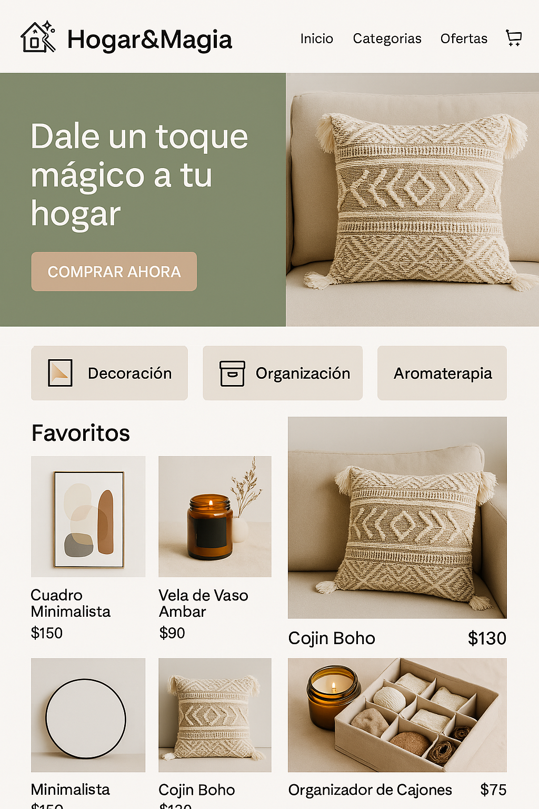
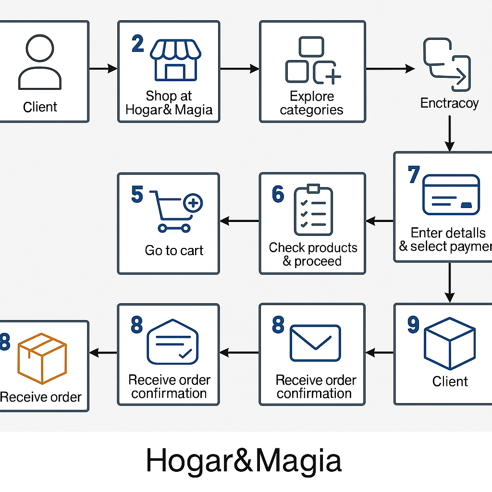

# Hogar&Magia

## Descripción de tu tienda online
Hogar&Magia es una tienda online dedicada a ofrecer productos únicos y accesibles para decorar y organizar tu hogar. Desde cojines y velas decorativas, hasta organizadores, cuadros y utensilios prácticos, todo está pensado para darle un toque especial y funcional a tu espacio.

## Inventario de productos

| Producto                  | Categoría           | Precio | Descripción                                      | Material               |
|---------------------------|---------------------|--------|--------------------------------------------------|------------------------|
| Cojín Boho                | Decoración          | $130   | Cojín suave con diseño bohemio y flecos          | Algodón y lino         |
| Vela de Vaso Ámbar        | Aromaterapia        | $90    | Vela con aroma a vainilla en frasco de vidrio    | Cera vegetal           |
| Organizador de Cajones    | Organización        | $75    | Set de 4 compartimentos para ordenar tus cosas   | Tela reforzada         |
| Cuadro Minimalista        | Decoración de pared | $150   | Lienzo con diseño abstracto en blanco y negro    | Lienzo sobre bastidor  |

## Moodboard del diseño de la tienda

## Algoritmo del proceso de compra

1. El cliente entra a la tienda virtual de Hogar&Magia.
2. Explora las diferentes categorías (Decoración, Organización, Aromaterapia).
3. Añade uno o más productos al carrito.
4. Da clic en "Ir al carrito".
5. Confirma la lista de productos y procede a pago.
6. Ingresa sus datos y elige método de pago.
7. Recibe correo de confirmación y número de pedido.
8. El equipo de logística empaca y envía el pedido.
9. El cliente recibe su compra en casa.

## Diagrama de flujo del algoritmo
